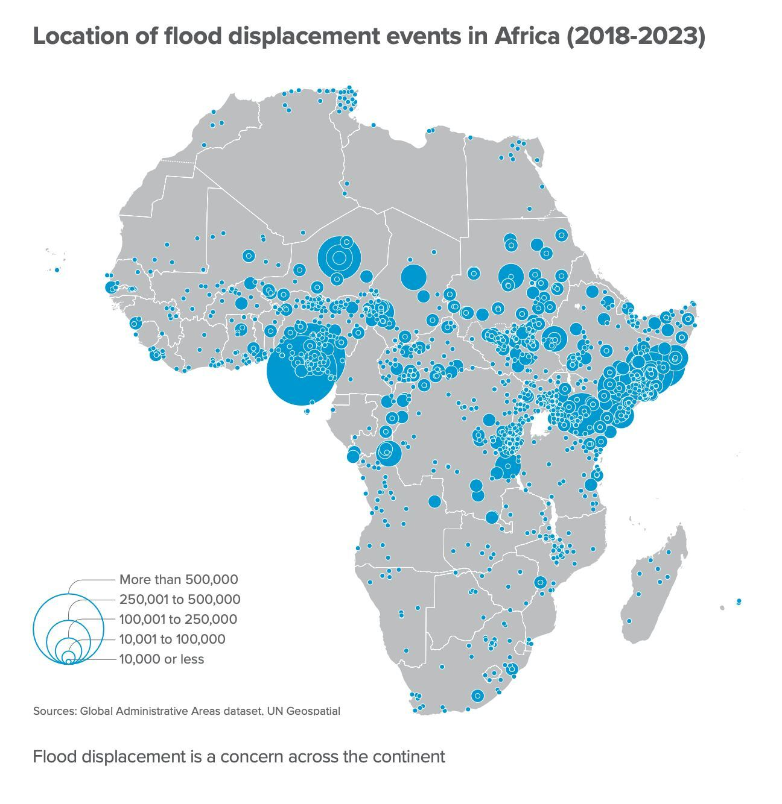

# __THE CURIOUS MINDS💡!__

*Welcome to the Curious Minds' repository! We are thrilled to have you here.*

Exploring Data Science with Python — Learning Together, Building Trust.

## Who are we? 🌟

We are a group of passionate data science enthusiasts who believe in the power
 of collaboration and shared learning. Our mission is to explore the vast world
  of data science using Python, while fostering a supportive community where
   everyone can grow and thrive.

### Research Topics

- Climate change
- Climate Injustice
- Extreme Weather conditions predicition
  
## About Our Project

You can access more information about the process of choosing the question in the
[brainstorming](0_domain_study/brainstorming.md) file.

### 🚀 Problem Statement

Urban flooding is becoming increasingly common in rapidly growing cities. As
cities expand, natural land surfaces are replaced with buildings, roads,
and other infrastructure. This change __reduces the land’s ability to
absorb rainfall__, potentially leading to more severe and frequent floods.
Despite these concerns, there is limited data-driven research quantifying the
relationship between urbanization and flood extent in the __East African__ regions.

This is where data science can play a transformative role. By leveraging
satellite imagery, hydrological data, current and historical climate data, such
as flood patterns, together with machine learning models, we can develop early
warning systems, improve flood forecasting, and optimize emergency response
efforts.The goal is __to support better urban planning and disaster risk management
by providing a clearer understanding of how unchecked urban growth may influence
flood risks.__

### 🔬 Actionable Research Questions

> How has urban expansion over the past two decades influenced the frequency and
> spatial extent of the flood events in Kampala and Addis Ababa?

### 🧠 Our group understanding of the problem domain

*Access our Group's detailed
understanding
of the domain in
the [background review](0_domain_study/background_review.md) file and
[Summary of Understanding](0_domain_study/summary_of_our_understanding.md)
file.*

### 🧩 How we chose to model the domain?

We wanted to understand how urban growth  in East Africa might be making flooding
in the River Nile worse over time. We chose __Addis Ababa__ and __Kampala__
because they are among the fastest growing cities in East Africa.Their
vulnerability to seasonal flooding, combined with increasing population density
and the availability of relevant flood data, makes them
 ideal case studies for analyzing how urban growth may contribute to flood risk.
 To do this, we looked at three main things:

- How much of the city area is covered by buildings and roads (urban area) each year.

- How much land was flooded during heavy rains in the same time periods.
  
- The amount of rainfall in each year

To get these insights we used data in `.csv` format and the data we couldn't
find in a
tabular form was __extracted__ from __satellite images__ in `.tif` format. The
possible __flaws in our approach__ are. Inaccuracy of data due to the use of
satellite data which depends on ground stations that are scarce in the east
african region. Also there might be errors in the extraction of data from
satellite images.

*You can access the datasets used
in the project in the [datasets](1_datasets/cleaned_datasets) file.*

## How do we team up?🤝

We work together in the following ways:

- [Our Norms](https://github.com/MIT-Emerging-Talent/ET6-CDSP-group-01-repo/blob/main/collaboration/README.md)
- [Our Communication](https://github.com/MIT-Emerging-Talent/ET6-CDSP-group-01-repo/blob/main/collaboration/communication.md)
- [Our Constraints](https://github.com/MIT-Emerging-Talent/ET6-CDSP-group-01-repo/blob/main/collaboration/constraints.md)
- [Our Learning-goals](https://github.com/MIT-Emerging-Talent/ET6-CDSP-group-01-repo/blob/main/collaboration/learning_goals.md)
- [Our retrospectives](https://github.com/MIT-Emerging-Talent/ET6-CDSP-group-01-repo/tree/milestone_0_retrospective/collaboration/retrospectives)

## Meet the amazing minds working on this project👩🏻‍🤝‍👨🏿

- [__Gai Samuel__](https://github.com/GaiSamuel)
- [__Hiba Daffallah__](https://github.com/Hiba-Daffallah)
- [__Rama Arafeh__](https://github.com/RamaBio20)
- [__Nada Hamza__](https://github.com/Nadaali1232)
- [__Dr.Amin Abd Elraheem__](https://github.com/Dr-Amin-K)
- [__Ndubuisi Agbo__](https://github.com/ndubuisia)

### 🤝 Contributing

We welcome contributions! Please see our guidelines
for [contributing](CONTRIBUTING.md).
