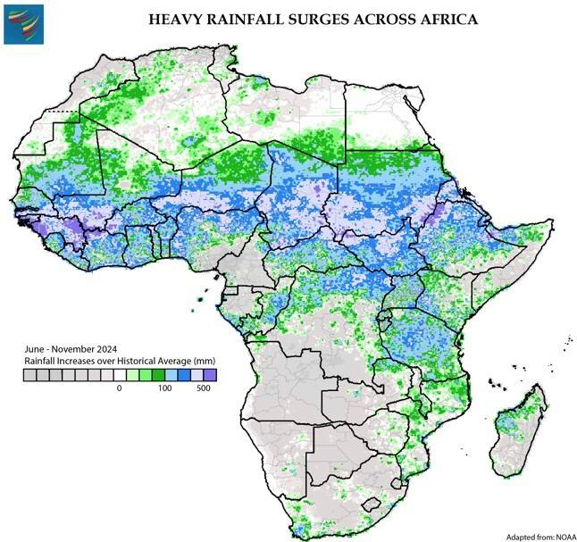
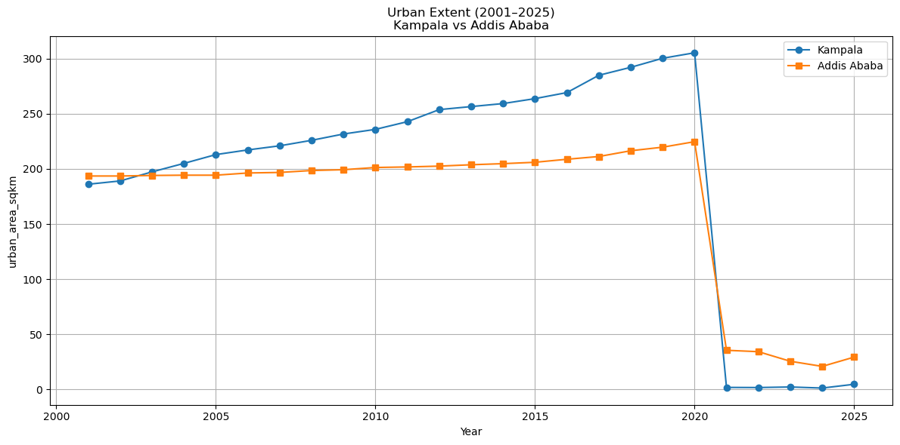

# __THE CURIOUS MINDS💡!__

*Welcome to the Curious Minds' repository! We are thrilled to have you here.*

Exploring Data Science with Python — Learning Together, Building Trust.

## Who are we? 🌟

We are a group of passionate data science enthusiasts who believe in the power
 of collaboration and shared learning. Our mission is to explore the vast world
  of data science using Python, while fostering a supportive community where
   everyone can grow and thrive.

---

## About Our Project

You can access more information about the process of choosing the question in the
[brainstorming](0_domain_study/brainstorming.md) file.

### 🚀 Problem Statement

Urban flooding is becoming increasingly common in rapidly growing cities. As
cities expand, natural land surfaces are replaced with buildings, roads,
and other infrastructure. This change __reduces the land’s ability to
absorb rainfall__, potentially leading to more severe and frequent floods.
Despite these concerns, there is limited data-driven research quantifying the
relationship between urbanization and flood extent in the __East African__ regions.

This is where data science can play a transformative role. By leveraging
satellite imagery, hydrological data, current and historical climate data, such
as flood patterns, together with machine learning models, we can develop early
warning systems, improve flood forecasting, and optimize emergency response
efforts.The goal is __to support better urban planning and disaster risk management
by providing a clearer understanding of how unchecked urban growth may influence
flood risks.__

### 🧠 Our Group's Understanding Of The Problem Domain

*Access our Group's detailed
understanding
of the domain in
the [background review](0_domain_study/background_review.md) file and
[Summary of Understanding](0_domain_study/summary_of_our_understanding.md)
file.*

---

## 🔬 Actionable Research Questions

 __*How has urban expansion influenced the frequency and*__
 __*spatial extent of the flood events in Kampala and Addis Ababa, considering*__
  __*rainfall variability?*__

### 🧩 A Non Technical Explanation On How We Chose To Model The Domain?

We wanted to understand how the growth of cities like __Kampala and Addis Ababa__
 might be making floods worse over time, especially when
  combined with changing rainfall patterns. Our goal was to use real satellite
   data to explore whether there's a __connection between urban growth, rainfall,
    and flood events__, and what that might mean for future city planning.
To do this, we looked at three main types of data:

- 🏘️ __Urban Extent__ - *How much of each city is covered by buildings or built-up*
 *land each year*.

- 🌧️ __Rainfall__ – *How much rain fell each month, using high-resolution*
 *satellite rainfall maps*.

- 🌊 __Flood Extent__ – *How much of each city was covered by floodwaters each month*,
 *based on flood mapping from satellite images*.

Since these data sets all come in __different formats and time scales__ (some are
 monthly, others are yearly), we standardized everything to an __annual scale__,
  so we could compare them year by year. These are the
   [cleaning scripts](https://github.com/MIT-Emerging-Talent/ET6-CDSP-group-01-repo/tree/main/2_data_preparation/cleaning_scripts)🧹
    we used for the datasets. We combined the three datasets into one big table
     where each row represents a year for a city, with columns for:

- 🌧️ Total rainfall in that year
- 🏙️ Amount of urbanized land
- 🌊 How much flooding occurred

This allowed us to look for patterns like:

1. Do floods get worse in years when urban areas grow fast?

2. Is there more flooding in years with heavier rainfall?

3. Do both factors (rain + buildings) work together to cause floods?

### ⚠️ Possible Flaws In Our Approach

🔁 __Different data time ranges__  

Rainfall and urban extent data go back to 2005 , but flood data only starts
 in 2015. Also, the urban extent data was sourced from two sources with the
  sourced data from Dynamic World that starts from `2021-2025` not being
   consistent with that sourced from `MODIS`(`2001-2020`).  So, we can only
    model trends from `2015–2020`, making us deal with limited data than we
     would've needed.

🏗️ __Urban area does not capture infrastructure quality__  

Urban extent only tells us how much of the land is built-up, but it doesn’t
 tell us if there are proper drainage systems, green spaces, or flood defenses.

📅 __Annual summaries may hide short-term extremes__  

Floods often happen due to intense rainfall in a few days or weeks. Our yearly
 totals may smooth out those spikes.

🌥️ __Flood data is sometimes incomplete__  

Some flood maps from satellites may miss small or fast-dissipating flood events
 due to cloud cover, revisit gaps, or low image quality.

>*You can access the datasets used
in the project in the [datasets](1_datasets) file.*

---

.jpg)
               

---

### 🧩 A non-technical explanation of our findings

We wanted to gain insights on how rainfall levels and urban growth affect the flood
extent in cities, in our case __Kampala and Addis Ababa__, in order to help
decision makers and people predicting flooding severity and take appropriate measures.
Our objective was describing such interactions via mathematical models (descriptive)
and various parameters.

To do this, we looked into our cleaned  data of annual:

- 🏘️ __Urban Extent__

- 🌧️ __Rainfall__

- 🌊 __Flood Extent__

We processed the cleaned data in order to analyze it, and make sure that each of
the aforementioned datasets cover the same period of time.

Here initially we faced two main problems:

- We noticed that part of the urban extent values looked odd and extremely small
(almost zero) which we realized is due to the data being collected from two
different sources.
This contradicts our knowledge of the two cities.

- Another problem was that we realized that our dataframe (where all the datasets
overlap) is quite short (2015-2020), which would limit our analysis.

To overcome these problems and to get further insights we thought of using two approaches:

1. Generate synthetic data, in order to increase the period we are analyzing.

2. As one of the main impacts of floods is on people and their livelyhoods, we tried
to find population-related data and information from various sources
(reports, news, infographics, governmental and non-governmental plans), as we couldn't
find datasets regarding the matter. Still, we couldn't find enough information
to include in our analysis.

### Findings

Our analysis explored the dynamics between urbanization, rainfall, and flooding
in Addis Ababa and Kampala. The key findings are:

__1. 📶 Significant Urban Growth:__

Both cities experienced significant and steady urban expansion over the observed
period.

__2. 🔀 Complex Correlation:__

At first glance, it seemed that more city growth led to more flooding. However,
when we looked at each city separately, the relationship wasn’t so straightforward—
sometimes more urban expansiont meant less flooding. This suggests
that other factors, such as topography, infrastructure, or specific rainfall events,
play a crucial role and that city-level analysis is essential.

__3. 📈 Time Series Trends:__

Urbany expansion has been steadily increasing. Rainfall, on the other hand,
stayed fairly consistent. We noticed that flooding changed more unpredictably,
suggesting that it’s not only rainfall that affects floods

### Uncertainties and possible sources of errors

While our analysis provides insights, there are several limitations and sources of
uncertainty that should be kept in mind, such as:

🔁 __Data from Different Sources__

Some of the urban extent data came from different sources, which don't necessarily
match.

📍 __Missing Factors__

We were unable to include other important factors like population growth,
land use planning, and drainage infrastructure, due to lack of consistent data.
These likely play a role in how floods impact each city.

🌍 __Local Differences__

The studied cities have different topographies, development patterns,
and infrastructure quality. This makes it harder to generalize findings.

🧬 __Use of Synthetic Data__

To extend the analysis period, we generated synthetic data. While this can help
identify patterns, it also introduces uncertainty because the generated data may
not fully reflect real-world changes.

---

## How do we team up?🤝

We work together in the following ways:

- [Our Norms](https://github.com/MIT-Emerging-Talent/ET6-CDSP-group-01-repo/blob/main/collaboration/README.md)
- [Our Communication](https://github.com/MIT-Emerging-Talent/ET6-CDSP-group-01-repo/blob/main/collaboration/communication.md)
- [Our Constraints](https://github.com/MIT-Emerging-Talent/ET6-CDSP-group-01-repo/blob/main/collaboration/constraints.md)
- [Our Learning-goals](https://github.com/MIT-Emerging-Talent/ET6-CDSP-group-01-repo/blob/main/collaboration/learning_goals.md)
- [Our retrospectives](https://github.com/MIT-Emerging-Talent/ET6-CDSP-group-01-repo/tree/milestone_0_retrospective/collaboration/retrospectives)

## Meet the amazing minds working on this project👩🏻‍🤝‍👨🏿

- [__Gai Samuel__](https://github.com/GaiSamuel)
- [__Hiba Daffallah__](https://github.com/Hiba-Daffallah)
- [__Rama Arafeh__](https://github.com/RamaBio20)
- [__Nada Hamza__](https://github.com/Nadaali1232)
- [__Dr.Amin Abd Elraheem__](https://github.com/Dr-Amin-K)
- [__Ndubuisi Agbo__](https://github.com/ndubuisia)

### 🤝 Contributing

We welcome contributions! Please see our guidelines
for [contributing](CONTRIBUTING.md).
